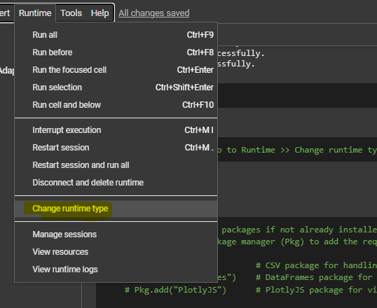

# Running the Notebook in Google Colab

Quant Researcher: Ali Ghaziasgar
MMF 2024-2025


This guide provides step-by-step instructions on how to open and run the `code_jl.ipynb` notebook in Google Colab.

## Prerequisites
1. **Google Account**: Ensure you have a Google account to access Google Colab.
2. **GitHub Repository**: Save this notebook (`code_jl.ipynb`) in your GitHub repository if you wish to open it directly from GitHub.

## Steps to Run the Notebook in Colab

### Option 1: Directly from GitHub
1. **Upload Notebook to GitHub**:
   - First, upload the notebook file (`code_jl.ipynb`) to a GitHub repository.
   
2. **Open in Colab**:
   - Navigate to [Google Colab](https://colab.research.google.com/).
   - Click on **File** > **Open Notebook**.
   - Go to the **GitHub** tab and authorize Google Colab to access your GitHub account if necessary.
   - Search for your GitHub repository and select the `code_jl.ipynb` notebook to open it in Colab.

### Option 2: Upload the Notebook Directly to Colab
1. **Download the Notebook**:
   - If the notebook is not already saved to your Google Drive, download it to your local machine.

2. **Upload to Colab**:
   - Open [Google Colab](https://colab.research.google.com/).
   - Click on **File** > **Upload Notebook**.
   - Select `code_jl.ipynb` from your local machine to upload it.

## Setting the Runtime to Julia

To run Julia code in Colab, you’ll need to switch the runtime type:

1. Go to **Runtime** > **Change runtime type**.
2. In the **Runtime type** dropdown, select **Julia** as the kernel.



> Note: After changing the runtime type, make sure to re-run the initial cells to set up the Julia environment.

## Running the Notebook

Once the notebook is open in Colab:
1. **Check and Install Dependencies**: Ensure that all required packages are installed. You can include the following code snippet at the beginning of your notebook to install missing packages if necessary:
   ```julia
   using Pkg
   Pkg.add("PackageName")  # Replace "PackageName" with the required package names
